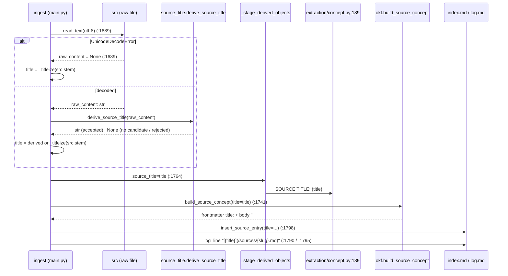

# Design: Derive a Source's title from its content

## Technical Approach

One new pure module, `src/openkos/source_title.py`, exposing exactly one public function:

```python
def derive_source_title(raw_content: str) -> str | None: ...
```

`str` in, `str | None` out. No I/O, no `openkos` imports, no exceptions. `None` means "no usable
candidate"; the caller keeps `_titleize(src.stem)`. `ingest` calls it once, immediately after the
UTF-8 decode, and the single resulting `title` variable feeds all seven downstream consumers
unchanged. `okf.build_source_concept` is not touched.

## Architecture Decisions

### Decision: module placement — a new top-level `source_title.py`

| Option | Verdict |
|---|---|
| `src/openkos/source_title.py` (chosen) | Top-level single-purpose module, the shape `lint.py`, `sensitivity.py`, `lifecycle.py`, `config.py`, `fsio.py` already use. Zero `openkos` imports (stdlib `re` only), so the canonical/derived layering rule is satisfied *vacuously* — it cannot violate a rule it has no edges to. A module is not a package, so "start lean — create a package only when its code arrives" is not engaged. |
| `bundle/source_title.py` | Rejected. `bundle/` holds primitives over the **bundle's own generated markdown** — `index.md`, `log.md`, links, merge, provenance, listing. This helper reads an arbitrary user file under `raw/`, which is not a bundle artifact. Filing it here would blur the package's meaning to buy nothing. |
| `model/okf.py` | Rejected. `okf.py` defines OKF document structure; this is a text scanner over non-OKF input. The proposal also pins that `okf` gains no validation — putting the validator in its file invites exactly that drift. |
| private `_derive_source_title` in `cli/main.py` | Rejected on size and blast radius, not on testability. Testability alone does not force a move: `tests/unit/cli/test_ingest.py` already unit-tests `main._collision_family` and `main._stage_derived_objects` directly. But this is ~120 lines with four module-level regex/constant definitions and 15+ branches, added to a 7000-line file, and its branch-coverage tests would then live in a CLI test module that requires `runner`/`tmp_path` scaffolding in scope. |

`_titleize`/`_slugify` stay where they are. They are 2-line filename cosmetics with no branches;
this helper is a content scanner with a validation contract. Different weight, different home. The
new module does **not** import them — `cli/main.py` composes the fallback at the call site.

### Decision: fence masking — copy the state machine, do not import or extract

**Choice**: reimplement fence tracking as three lines inside the single walk, with a local
`_FENCE_MARKERS: Final = ("```", "~~~")` constant. `bundle/links.py` is unchanged and its callers
are unaffected.

**Alternatives considered**: (1) import `links._mask_fenced_code_blocks`; (2) extract it to a shared
module that `links.py` and `source_title.py` both import.

**Rationale**: this is the repo's *documented* stance, not a shortcut. `bundle/links.py`'s module
docstring (`links.py:22-31`) states that its `_mask_fenced_code_blocks` is "a deliberate,
intentional DUPLICATE of `graph/sqlite_graph.py`'s copies … not an import", citing the `#922`
`_link_identity` precedent. Two sanctioned copies already exist. Beyond precedent, the shape is
wrong for reuse: `_mask_fenced_code_blocks` returns a **whole masked document**, and `_iter_safe_lines`
then zips it against the original — two full passes and an allocation of a second document, to
answer a question this walk already answers incrementally with one `str | None`. Importing an
underscore-private name across modules is also not done anywhere in this codebase. Extraction (2)
would touch `links.py`, its docstring rationale, and `tests/unit/bundle/test_links.py` for a
primitive the repo has twice decided to duplicate on purpose — pure review cost.

**What is duplicated is precisely bounded**: the marker tuple and the "same 3-char marker closes the
fence it opened" rule. The module docstring must cite `bundle/links.py:50-74` and
`graph/sqlite_graph.py` as the sibling copies, so the third reader finds the family instead of
rediscovering it.

### Decision: normalization before validation, and length measured last

Fixed order, and the order is load-bearing:

| Step | Operation | Why it must be here |
|---|---|---|
| 1 | `text = " ".join(candidate.split())` | Collapses whitespace runs **and** strips, in one call. It also destroys a trailing `\r` from a CRLF source and any tab — so a CRLF file is never rejected by the control-character class. Reversing steps 1 and 3 would reject every CRLF source. |
| 2 | *(ATX heading only)* `_ATX_CLOSING_RE.sub("", text)` where `_ATX_CLOSING_RE = re.compile(r" #+$")` | Post-collapse, interior whitespace is exactly one space, so the closing-sequence regex needs no `\s+`. It requires a **space before** the `#` run, which is what protects a legitimate trailing `#`: `Grade A#` and `C# vs F#` are untouched; `Title #` becomes `Title`. Skipped for a plain first line — there the `#` is content, not heading syntax. |
| 3 | reject if empty | After collapse a whitespace-only heading (`#    `) is empty. |
| 4 | reject if `len(text) > _TITLE_MAX_CHARS` (120) | Measured on the **final** string, per the proposal's "120 chars post-normalization" — a heading padded with 200 spaces is not rejected for length. |
| 5 | reject if `_FORBIDDEN_IN_TITLE.search(text)` | See below. |

`_FORBIDDEN_IN_TITLE = re.compile(r"[\x00-\x1f\x7f\[\]()\`*_<>|]")` — one compiled character class,
following `lint._UNSPELLABLE_IN_SPAN` (`lint.py:603-622`). Its docstring MUST justify every member
individually and name what is deliberately **not** in it:

- `[ ] ( )` — break the `[title](/path.md)` bullet in `index.md`/`log.md` silently; only `\n`/`\r`
  raise there today (`index.py:42-52`, `log.py:32-43`).
- `` ` `` — opens an inline code span in the Source's own `# {title}` H1 (`okf.py:217`) and in every
  bullet; `lint._UNSPELLABLE_IN_SPAN` already rejects it for `resource`.
- `* _` — inline emphasis; the title would render as emphasis instead of as itself.
- `< >` — `<` opens raw HTML / an autolink; `>` reads as blockquote, and as prompt structure in
  `extraction/concept.py:189`.
- `|` — a table pipe splits any future cell the title lands in.
- `\x00-\x1f` — every C0 control, which *includes* `\n` and `\r`: the only two characters
  `index.py`/`log.py` reject by **raising**, so admitting them would convert a cosmetic problem into
  a hard ingest failure at `main.py:1835`. TAB is in this range but is unreachable by construction —
  step 1 already collapsed it. Say so; do not imply a live rejection.
- `\x7f` DEL — a control that no normalization removes and that renders as nothing.

Deliberately **not** rejected, stated so nobody over-corrects: `#`, `&`, `"`, `'`, `:`, `-`, and all
non-ASCII. Both shipped example first lines contain an em dash (`—`); a greedier class would
regress the repo's own flagship corpus.

### Decision: a rejected H1 returns `None` — it does not cascade to rule (b)

`# [Draft] Notes` yields `None` and the caller falls back to the slug. It does **not** re-enter the
plain-line predicate. The proposal reads "any failure falls back to (c)", and a cascade would make
the output depend on *why* the H1 failed. Pin this in the docstring as a "what this must NOT do".

### ADR gate

Evaluated against both conditions. (1) Yes — this decides a pattern and a module interface.
(2) **No** — the proposal's own rollback plan shows reversal is a single revert with no backfill and
no read-time re-derivation. Both conditions are not met, so **no ADR is created**.

## Data Flow

### The single walk

`raw_content` → one bounded prefix probe → one linear pass → `str | None`.

```
_frontmatter_end(lines)          # bounded probe: only when lines[0] == "---",
                                 # scan for a later exact "---"; found -> index+1, else 0
        │
        ▼
for index in range(start, len(lines)):        ← THE pass
        │
        ├─ inside a fence?  → close it if the marker matches; continue
        ├─ opens a fence?   → remember the 3-char marker; continue
        ├─ blank?           → continue
        ├─ matches _ATX_H1_RE? → normalize(heading=True) → validate → RETURN str | None
        └─ first non-blank seen? → remember `first_body_index`; keep scanning for an H1
        │
        ▼
first_body_index is None → return None
else evaluate rule (b) using lines[first_body_index] and lines[first_body_index + 1]
```

Lookahead is what usually forces a second pass: rule (b) needs to know whether the **next physical
line** is blank or EOF. This design does not look ahead — it remembers the *index* and reads
`lines[i + 1]` after the loop, from the list it already holds. `split("\n")` makes both endings
agree: `"content"` → `["content"]` (EOF), `"content\n"` → `["content", ""]` (blank). The frontmatter
probe stays a separate bounded function on purpose: folding it in would give the main loop a mode
flag that can only ever be true for a prefix, which is strictly less readable than one named call.

Rule (b) plausibility, on the normalized text plus the raw next line:
next line is blank or EOF; text does not end in `.`, `,`, `;`, `:`; text does not start with
`-`, `*`, `>`, `#`, `|`, ` ``` `, or `~~~`; then the same shared validator (non-empty, ≤120, no
forbidden character).

### Call-site wiring in `ingest`

Delete `title = _titleize(src.stem)` at `main.py:1684`. Insert, immediately after the
`except UnicodeDecodeError: raw_content = None` block ends (`main.py:1689`), before the
`if raw_content is None:` description branch:

```python
derived = None if raw_content is None else source_title.derive_source_title(raw_content)
title = derived if derived is not None else _titleize(src.stem)
```

The valid insertion interval is exactly **(`:1689`, `:1753`)**: it needs `raw_content` (decoded at
`:1689`) and must precede `_build_source_document`, whose closure captures `title` and is first
called at `:1753`. `now` and `resource` (`:1683`, `:1685`) stay where they are.

`slug` is unaffected. It is computed at `:1646` from `src.stem` and consumed by `concept_path`
(`:1651`) and the D4/D5 existence checks (`:1654-1674`) — all of which run **before** the decode and
none of which read `title`. The dependency is one-directional and already absent; moving the title
assignment down is structurally free.

**`extraction/concept.py:189` — the easy-to-miss one.** `_stage_derived_objects(source_title=title)`
at `main.py:1764` sits *below* the insertion point, so it receives the FINAL derived title, and the
LLM prompt's `SOURCE TITLE:` line changes accordingly. This is the proposal's accepted, non-blocking
consequence — but it is only true because the assignment lands above `:1753`. Placing the derivation
any lower (e.g. patching only the frontmatter) would feed the prompt a stale slug title. Guard it in
review.



One assignment, seven consumers, all downstream of it.

## File Changes

| File | Action | Description |
|---|---|---|
| `src/openkos/source_title.py` | Create | `derive_source_title` + 4 module constants (`_ATX_H1_RE`, `_ATX_CLOSING_RE`, `_FORBIDDEN_IN_TITLE`, `_FENCE_MARKERS`, `_TITLE_MAX_CHARS`) + 2 private helpers (`_frontmatter_end`, `_normalize_and_validate`). |
| `src/openkos/cli/main.py` | Modify | Import the module; delete `:1684`; insert the 2-line derivation after `:1695`. ~6 net lines. |
| `tests/unit/test_source_title.py` | Create | Pure unit suite; no filesystem, no `runner`. |
| `tests/unit/cli/test_ingest.py` | Modify | New integration tests + fixture-churn verification (see Risks). |
| `src/openkos/model/okf.py` | Unchanged | No validation added. Its "consumers validate at READ time" stance (`okf.py:145-167`) still governs; this change adds a WRITE-time filter at one call site and does not claim to supersede it. |
| `src/openkos/bundle/links.py` | Unchanged | Prior art cited, not modified. |
| `docs/adr/` | Unchanged | ADR gate evaluated; both conditions not met. |

## Interfaces / Contracts

```python
def derive_source_title(raw_content: str) -> str | None:
    """Derive a Source title from a raw source's decoded text, or `None`."""
```

Docstring must pin, in this repo's house style (issue-number citations + explicit "what this must
NOT do"):

- **Purity and idempotence** — depends only on `raw_content`; no clock, no filesystem, no locale, no
  randomness. This is what makes byte-identical bytes produce a byte-identical Source document.
- **`None` is not an error** — it means "no usable candidate"; the caller supplies the slug fallback.
  This function MUST NOT raise, and MUST NOT know about filenames, slugs, or `_titleize`.
- **No cascade** — a rejected H1 returns `None`; it does not retry rule (b).
- **The fence duplication** — cite `bundle/links.py:50-74` and `graph/sqlite_graph.py` as the
  sibling copies and why this is a third one rather than an import.
- **Not a general sanitiser** — it REJECTS, it never escapes or truncates. `okf.build_source_concept`
  gains nothing from this and still receives untrusted-by-contract input on the fallback path.
- **The frontmatter probe is fence-blind** — it matches python-frontmatter's own behavior; a `---`
  inside a fenced block in the first few lines can close a frontmatter scan. Named, accepted.
- **Issue #248**, and the naming caveat that the settled rule is broader than headings.

## Testing Strategy

| Layer | File | What |
|---|---|---|
| Unit | `tests/unit/test_source_title.py` | Every branch of the walk and the validator, `@pytest.mark.parametrize`, plain strings only. H1 found / H1 after prose / H1 inside a fence ignored / `~~~` fence / unclosed fence swallows the rest / fence closed only by its own marker / frontmatter skipped / frontmatter without a closing `---` treated as content / `---` rejected as a bullet prefix / no lines at all / whitespace-only document / plain line accepted / plain line followed by prose rejected / plain line at EOF accepted / each of `.,;:` terminals / each block prefix / each forbidden character / exactly 120 vs 121 chars post-normalization / CRLF source accepted / trailing `#` stripped / `C# vs F#` preserved / rejected H1 returns `None` without cascading. |
| Integration | `tests/unit/cli/test_ingest.py` | `# Introduction to Stoicism` reaches frontmatter `title:`, the body `# {title}` H1, the `index.md` bullet label, and the `log.md` link label in one ingest; a `# ` inside a fence does not; a rejected candidate produces byte-identical output to today's slug title; a binary source (`UnicodeDecodeError`) never calls the helper and keeps the slug title. |
| Integration | `tests/unit/cli/test_ingest.py` | **Idempotence pin**: `test_reingest_of_identical_bytes_writes_a_byte_identical_source_document` — reuse the existing `_FixedClock` monkeypatch pattern at `test_ingest.py:2385-2390`, because `timestamp` is refreshed on every re-ingest (`test_reingest_still_refreshes_timestamp_and_description`, `:2368`) and an unfrozen clock would make "byte-identical" false for reasons unrelated to the title. Precedent for the assertion itself: `test_reingest_with_equal_values_writes_byte_identical_output` (`:2401`). |

Branch reachability: every decision in the walk is driven by `raw_content` alone, so each branch has
a one-line string that reaches it. No branch requires `tmp_path`, `runner`, a fake LLM, or a config
fixture — which is the point of the module placement decision above and is what keeps
`fail_under = 90` with `branch = true` satisfiable without CLI scaffolding.

## Threat Matrix

N/A — no routing, shell, subprocess, VCS/PR automation, executable-file classification, or
process-integration boundary. The helper takes a `str` and returns a `str | None`.

One adjacent surface, named rather than matrixed: `extraction/concept.py:189` interpolates the title
into an LLM prompt with no delimiter. `` ` ``, `<`, `>` and the C0 controls in `_FORBIDDEN_IN_TITLE`
narrow that surface as a side effect; they are justified there on rendering grounds and this is a
secondary benefit, not the mitigation of record. The pre-existing gap for slug-derived titles is
unchanged.

## Migration / Rollout

No migration. No backfill (explicitly out of scope). No feature flag — the fallback path *is* the
old behavior, byte-for-byte, so the blast radius is bounded to sources that have a usable candidate.

## Open Questions

- [ ] None blocking. One finding for `sdd-tasks` to size: see Risks.
