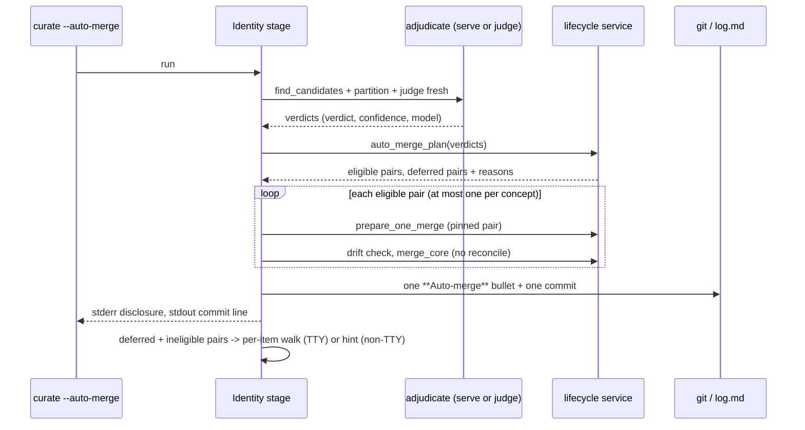

# Design: auto-merge-safe-class

Refs #1054. Proposal: `proposal.md`. ADR-0034.

## Overview

Two parts, strictly ordered. Part A (Phases 1-2) measures whether a
confidence threshold exists under which the adjudicator's `SAME` verdicts
on the eligible class never merge two different things. Part B (Phases
3-6) builds `curate --auto-merge` on top of that threshold, **and is built
only if Part A's pre-registered rule passes.** Everything in Part B below is
the plan for the PASS branch; on FAIL none of it is written.

The decision rule in §"Decision rule" is written here, in the planning
commit, before any live run. It MUST NOT be edited after the first live
number is seen. A later change that wants a different rule records it as a
new, separately pre-registered rule and re-runs both arms.

## D1 — Harness first, with a hard STOP

**Decision.** Phase 2 ends in one of three verdicts, computed by code
(`--decide`), not by reading tables: `PASS`, `FAIL`, `INVALID`. `INVALID`
re-runs the affected arm (the measurement did not happen). `FAIL` stops the
change: no Part B task starts, the verdict file is committed, and the
result is posted on #1054 for the owner. `PASS` unlocks Phase 3.

**Why.** The owner's condition (B4) and this repo's record: a longer
extraction prompt lost its A/B, five adjudication prompt treatments were
measured and rejected, and #869 found the wild recurrence shape judged
`same` at 0.95. A mode that deletes concepts unattended cannot be adopted
on intuition.

## D2 — The signal is the adjudicator's stated confidence

**Decision.** The measured signal is `AdjudicatedCandidate.confidence` of
the FINAL verdict (after `withdraw_self_refuting_same`), for trials whose
final verdict is `SAME`. The auto-merge decision at threshold `t` is
`verdict == SAME and confidence >= t`.

**Why.** It is the signal the owner named ("the confidence threshold"), and
it exists for every eligible pair: it is persisted in
`adjudications.confidence` and served with the verdict.

**Alternatives not measured here.** Unanimity across `k` re-judgments (costs
`k` calls per pair in production), candidate tier (`HIGH`/`ACRONYM`/`LOW`),
and provenance overlap. They are recorded so that, if the confidence rule
FAILs, the owner can choose which one earns its own pre-registered rule.
The harness stores every rationale verbatim (#807's precedent) and the tier
and cross-source flag per trial, so tier and provenance can be rescored
offline without re-spending the runs; unanimity cannot, and is not claimed.

## D3 — The population is the owner's eligible class

**Decision.** A fixture pair is in the measured population only if the
production predicates, run model-free on the materialized bundle, admit it
structurally: `find_candidates` yields exactly one 2-member group for it;
both members declare the same non-empty OKF `type`;
`lifecycle.cross_type_concern(...) is None`; and `prepare_one_merge` does
not return a `StackedRefusal`-class plan (`stacked_body.exceeds_guardrail`
false). The `--self-test` asserts this for every labelled pair, so an
ineligible pair is a fixture defect caught in CI, never a silent exclusion.

`cross_source_same_pair` is NOT a filter (proposal: "Discrepancy flagged").
It is recorded per trial, and `--decide` reports every bar a second time on
the cross-source-excluded subpopulation as a **secondary, non-deciding**
result.

## D4 — Calibration and confirmation are separate arms

**Decision.** The threshold is chosen from one arm and judged on another.
`--arm calibration` and `--arm confirmation` are two invocations, 15 runs
each, same fixture digest, same model, production sampling (no seed or
temperature pinned — pinning would make every run identical and the
stability bar would measure nothing), production context window and
generation ceiling (`config.DEFAULT_CONTEXT_WINDOW`,
`config.DEFAULT_MAX_GENERATION_TOKENS`). 15 is the floor: a 5-run arm has
swung 0.25 against itself on this repo's LLM harnesses (#765).

**Why.** A threshold picked as "just above the worst negative" on the same
data it is scored on passes the zero-false-merge bar by construction. That
verdict would be vacuous.

## Fixture

`evals/auto_merge/auto_merge_fixtures.py`, committed, pure data, producing
a bundle deterministically in a temp directory (no network, no model, no
private corpus). Every document carries `type`, `title`,
`sensitivity: private` (an absent value fails closed and every group would
short-circuit to `UNCERTAIN` without calling the model — the adjudication
harness's documented trap), and a `provenance:` list so the cross-source
flag is computable. Reuse of `evals/adjudication/adjudication_fixtures.py`
pairs is by import, not copy, and only for pairs D3 admits (its
`transitivity` class is cross-type and is excluded by construction).

Minimum composition, enforced by `--self-test`:

| class | expected | min pairs | what it guards |
|---|---|---|---|
| `week-apart` | different | 3 | **the owner's named negative**: one series title, disjoint provenance, dates seven days apart, different attendees or decisions |
| `recurrence` | different | 2 | #796's reported class (imported) |
| `asym-recurrence` | different | 3 | #869's wild shape, including `grupo-calidad-datos`, judged `same` 13/15 at 0.95 today (imported) |
| `namesake-person` | different | 2 | two different people with one name, disjoint affiliations |
| `aspect-or-part` | different | 2 | same-type part-whole / aspect-of (imported where D3 admits) |
| `reingest-dup` | same | 3 | the re-ingest accumulation case: one source compiled twice, shared provenance |
| `event-same` | same | 2 | one meeting recorded twice from two sources (imported) |
| `person-same` | same | 2 | identical name IS identity for a Person |
| `alias-same` | same | 2 | one entity, two names |
| `asym-same` | same | 1 | sparse-but-genuine duplicate (imported) |

Totals: **at least 12 negative pairs across at least 5 classes, at least 10
positive pairs across at least 4 classes.** Labels are constructed, not
adjudicated; the results file says so (see "What a PASS does not
establish").

## Decision rule (PRE-REGISTERED — do not edit after the first live run)

Notation, per arm: a **trial** is one labelled pair in one run. `N` =
negative trials, `P` = positive trials. For a trial, `same` means final
verdict `SAME`, and `s` is its confidence.

**Step 1 — threshold, from the calibration arm only.**

- `B` = the HIGHEST `s` over calibration negative trials with `same`
  (`B = -inf` when there are none).
- `t*` = the LOWEST `s` over calibration positive trials with `same` such
  that `s > B`.
- If no such positive exists, the verdict is **FAIL (no separator)**. The
  lowest good must sit strictly above the highest bad.
- If `B = -inf`, `t*` is still computed and the verdict file MUST label the
  threshold **non-binding** (no negative ever reached it, so it was never
  tested); the bars below still decide.

**Step 2 — bars, on the confirmation arm with `t*` fixed.**

| Bar | Metric | Pass when | Why this level |
|---|---|---|---|
| R0 | Validity | zero trials missing a result (`<missing>`, backend failure, group not formed); fixture digest and model identical across arms | a lost trial is not a measured trial; `INVALID`, re-run, never scored |
| R1 | Exposure | every labelled pair passed D3 (asserted by `--self-test`), so negative trials reaching the gate ≥ 12 × 15 = 180 | a zero-false-merge result means nothing without the cases that could have failed |
| R2 | False auto-merges | **0** negative trials with `same` and `s >= t*` | a false merge deletes a concept unattended; zero is the only bar the owner can accept for an off-by-default destructive mode. Reported with its rule-of-three upper bound `3 / N` |
| R3 | Owner's named negative | **0** `week-apart` trials auto-merged at `t*` in EITHER arm | named in B4; checked on both arms so a lucky confirmation run cannot hide a calibration merge |
| R4 | Retention | ≥ 0.50 of positive trials auto-merge at `t*` | below half, the mode removes too little of the queue to justify revising #702's rule |
| R5 | Stability | mean over positive pairs of the modal share of the auto-merge decision ≥ 0.80 | a decision that flips run to run cannot back an unattended write (same level as `evals/decision_revisions` B8) |

**Verdict.** `PASS` iff Step 1 yields `t*` and R0-R5 all hold. `INVALID` if
R0 fails (re-run; not a result). Otherwise `FAIL`, naming every failed bar.

**On PASS**, Phase 3 hard-codes `t*` exactly as measured (no rounding: any
rounding either admits a value at or below `B` or drops positives the bars
counted) and the model into the measured-model set.

**On FAIL**, STOP. Commit the verdict file, post the verdict and the
per-class table on #1054, and do not start Phase 3.

**Prior expectation, stated so the result cannot be read as a surprise:**
`evals/adjudication/README.md` reports stated confidence at 0.95 on right
and wrong verdicts alike, and `grupo-calidad-datos` judged `same` 13/15 at
0.95. If that holds, `B = 0.95`, no positive exceeds it, and the verdict is
FAIL (no separator).

### Secondary results (reported, never deciding)

- Every bar again on the cross-source-excluded subpopulation (D3).
- Per-class same/different/uncertain split and confidence histogram.
- Tier and cross-source flag per trial, for offline rescoring (D2).

### What a PASS does not establish

Constructed labels are rubric-consistency, not agreement with a human on a
real bundle; one model; de-identified analogues may be easier than real
documents. The verdict file carries this section verbatim.

## Harness shape

`evals/auto_merge/run_auto_merge_eval.py`, following
`evals/adjudication/run_adjudication_eval.py`:

- `--self-test` (model-free; runs under `run_self_tests.py`'s poisoned
  `OLLAMA_HOST`): materializes the fixture; asserts D3 for every pair and
  the class minimums; asserts the fixture digest is stable across two
  materializations; runs `decide()` on synthetic arms that MUST come out
  `PASS`, `FAIL (no separator)`, `FAIL R2`, `FAIL R3`, `FAIL R4`, `FAIL R5`,
  and `INVALID`, so every bar is shown able to fail.
- `--arm {calibration,confirmation} --runs 15 --model qwen3:8b`: the REAL
  production path per run — `find_candidates` then `adjudicate_candidates`
  on the temp bundle (no `findings.db`, so no verdict is ever served from
  cache), groups discovered, never hand-built.
- `--decide CAL.json CONF.json`: pure, offline; writes the verdict file.

### Results file format

All under `evals/auto_merge/results/`:

- `runs-<arm>-<UTCstamp>-<model>.json`:

  ```json
  {
    "schema": "openkos.eval.auto_merge/v1",
    "arm": "calibration",
    "model": "qwen3:8b",
    "git_sha": "<HEAD at run start>",
    "fixture_digest": "sha256:<over the materialized bundle>",
    "settings": {"context_window": 12288, "max_generation_tokens": 8192},
    "started_at": "<ISO-8601 UTC>",
    "runs": [
      {"run": 1, "trials": [
        {"pair_id": "...", "probe": "week-apart", "expected": "different",
         "tier": "high", "cross_source": true,
         "verdict": "same", "confidence": 0.95,
         "rationale": "<verbatim>", "latency_s": 18.4}
      ]}
    ]
  }
  ```

- `auto-merge-<arm>-<UTCstamp>-<model>.md`: the per-arm report, opening
  with `harness_report.arm_identity_line`, per-class tables, histograms.
- `auto-merge-verdict-<UTCstamp>-<model>.md`: `--decide`'s output — both
  input file names, `B`, `t*` (and whether non-binding), each bar's measured
  value against its bar, the verdict, the secondary population, and "What a
  PASS does not establish".

Live runs need **Ollama with `qwen3:8b`** (the packaged `DEFAULT_MODEL` and
the adjudication harness's model). Budget ≈ 22 pairs × 15 runs × ~19 s ≈
1.7 h per arm. Results JSON never contains a private-corpus document: the
fixture is committed, invented content only.

## Part B (built only on PASS)



### D5 — Measured models only, and verdicts learn their model

`application/lifecycle.py` gains `AUTO_MERGE_THRESHOLD` (`t*`) and
`AUTO_MERGE_MEASURED_MODELS` (`frozenset({"qwen3:8b"})`) beside the other
merge predicates. When the resolved adjudication task model is not in the
set, `--auto-merge` degrades to today's behavior with one stderr notice;
it never auto-merges under a model whose confidence was not measured.

`state.adjudications` gains a nullable `model TEXT` column (migrated the way
#838 added `rubric_digest`: an older store reads it as NULL). A served
verdict is auto-eligible only when its recorded `model` is in the measured
set; NULL is ineligible. Existing workspaces therefore get no auto merges
from old rows until those groups are re-judged — fail-closed by design.

### D6 — The switch is a `curate` flag only

`curate --auto-merge`, default off, per run. No `openkos.yaml` key in this
change: a persisted key is a standing consent to delete concepts that a
user can forget they gave, and adding one later is additive. `--auto-merge`
with `--reconcile` is refused (exit 2) — B5 makes auto merges mechanical,
so the combination has no meaning. `--accept identity` stays refused.

### D7 — Eligibility order (fail-closed at every step)

A pair auto-merges only if ALL hold, checked in this order, first failure
wins and is recorded as the deferral reason: final verdict `SAME`; exactly
two members; `cross_type_concern is None`; confidence `>= t*`; verdict
model in the measured set; neither member already touched by an automatic
merge in this run (B6 — stricter than "one per survivor", because an
absorbed concept that is also a survivor elsewhere would otherwise stack
two ledger entries); plan not stacked-guardrail-refused. The confidential
gate is unchanged upstream. The survivor is chosen as today
(`ordered_merge_pair`) and PINNED, as `--apply-same` pins it.

### D8 — Mechanical merges

Auto merges call `reconcile_planned(prepared, no_reconcile=True)` — no LLM
rewrite, so `unmerge` restores the pre-merge bytes exactly as it does for a
manual `merge --no-reconcile`.

### D9 — One commit, one run entry

Each auto merge still writes its own `**Merge**` bullet via `merge_core`:
`unmerge`'s surgical v5 reversal locates and removes exactly that bullet,
and dropping it would break reversal. After the last merge the run appends
ONE `**Auto-merge**` bullet listing every `survivor ← absorbed (confidence)`
and the threshold, then ONE `_autocommit` over every touched path. The
`**Auto-merge**` bullet's text never matches `merge_log_entry`'s shape, so
`unmerge`'s "bullet occurring more than once" refusal cannot fire on it;
`unmerge` leaves it in place as history, like its own audit line.

A mid-run write failure stops the auto pass, writes the run bullet for the
merges already applied, commits them, and discloses them (curate-command:
"A Failed Writing Stage Discloses What It Already Applied").

### D10 — Disclosure

stderr: one summary line (`auto-merged N pair(s) at confidence >= t*
(model M)`), then one line per merge naming survivor, absorbed, confidence
and the exact `openkos unmerge <survivor> <absorbed>`. stdout: the shared
commit line with `git revert <sha>`. Deferred pairs then take today's path.

## ADR gate

ADR-0034 records the one hard-to-reverse decision: Identity merges may be
applied without prior consent only for a class that passed a pre-registered
measurement, opt-in, with post-hoc review. It stands on FAIL as well: the
policy then admits no class yet. Numbers 0032/0033 are claimed by other
in-flight changes.
