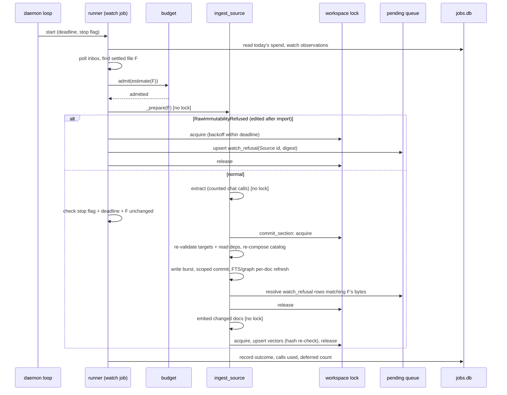
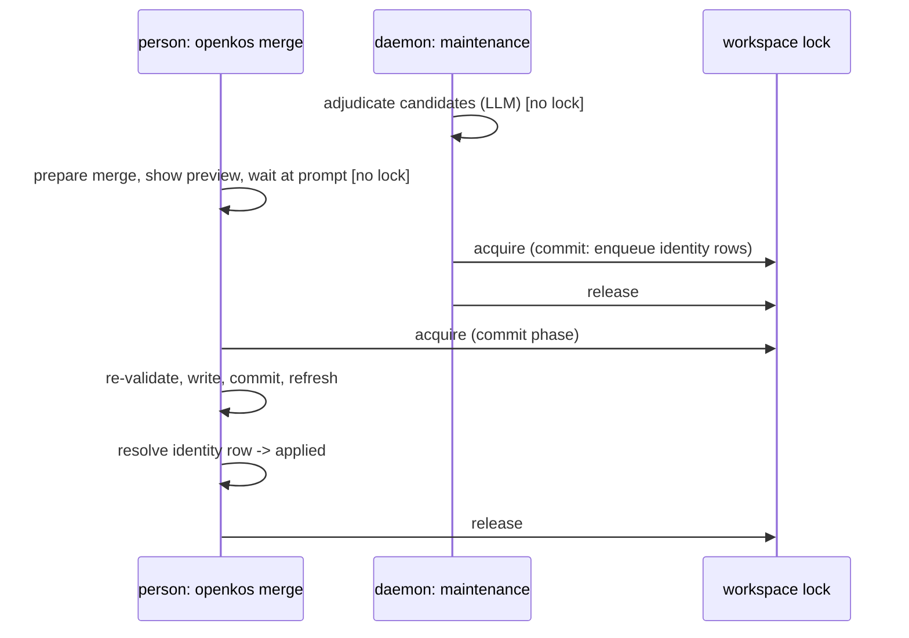

# Design: mvp4-unattended-foundations — the substrate MVP 4's unattended engine runs on

Refs #1137, #1139, #1140, #1141, #1142, #1143, #1168 (and #1128's deferred
fourth item). Inputs: `proposal.md`, the six design issues and their
comments, and the code at `35d6f609` (0.3.0). ADRs written by this design:
ADR-0036 (lock scope and location), ADR-0037 (the unattended/consequential
boundary and the queue), ADR-0038 (watcher inbox semantics), all
`Proposed`.

The six decisions were fixed by the maintainer before this design. This
document chooses the mechanism for each, states how they interact, gives
the data shapes, and -- in [Code reality check](#code-reality-check) --
lists every place the code contradicts a decision or an issue's premise.
Where a contradiction forced a mechanism the issue did not name, the
section says so.

## Technical approach

Four new pieces, and changes to existing ones:

```
                          openkos.yaml  unattended: {...}
                                 │
   inbox/ (user's, read-only) ───┤
          │ poll + settle        ▼
          │               ┌──────────────┐  policy (never consents)
          └──────────────►│  job runner  │──────────────────────────┐
     SIGTERM/SIGINT ─────►│ (sync, one   │  budget admission        │
     deadline ───────────►│  job at a    │  (estimate) + counting   │
                          │  time)       │  (actual chat calls)     │
                          └──────┬───────┘                          │
                     application services (ADR-0018; #1168 extractions)
                                 │
              compute (no lock)  │  commit phase (lock, per unit)
      ┌──────────────────────────┼─────────────────────────────────┐
      │ extract / judge / probe  │ re-validate → write → commit →   │
      │ embed                    │ FTS+graph per-doc refresh →      │
      │                          │ enqueue rows / upsert vectors    │
      └──────────────────────────┴─────────────────────────────────┘
          │                         │                 │
   .openkos/findings.db       .openkos/jobs.db   ~/.local/state/openkos/
   (+ pending queue)          (job outcomes,      locks/<digest>.lock
                               spend, watch obs)  logs/<digest>.log
          │
   next / status / pending / MCP pending  ── read-only ──►  human-facing
                                                            write paths
                                                            resolve rows
```

- **Commit-phase locking** (Decision 1) is the enabling change: without it
  a daemon and a person starve each other.
- **The runtime prerequisites** (Decision 2) make an unattended process
  observable, stoppable and bounded.
- **The budget** (Decision 3) bounds spend where nobody answers a gate.
- **The queue** (Decision 4) is where consequential work waits.
- **The watcher** (Decision 5) is the first job kind.
- **Per-document derived refresh** (Decision 6) is what keeps a commit
  phase short, so it is a dependency of Decision 1 in practice, not a
  separate optimisation.

## Decision 1 — Lock: compute lock-free, commit under a short lock (#1137)

**Choice.** Every locked verb becomes a compute phase with no lock and a
commit phase with the lock (ADR-0036). The commit phase is, in order:
re-validate → write burst → scoped auto-commit → FTS and graph refresh
(per-document, Decision 6). Embedding runs after the commit phase, outside
the lock, and the vector upsert re-takes the lock briefly and drops any
document whose content hash changed or that vanished. `purge` keeps a
whole-verb lock. Plain `query` joins the read-only class; `query --save`
locks only its filing.

**Mechanism.** Services already have the right seam for most of this.
`application/ingest_service.py` `ingest_source` sequences
`_prepare` → confirm → `describe_drift` → `_write` → `ports.autocommit` →
`ports.after_commit`. The commit phase is a new port,
`commit_section: Callable[[], AbstractContextManager[None]]`, entered
around drift → write → autocommit → FTS/graph refresh. The CLI passes a
context manager that acquires the lock (with `--wait` policy); the runner
passes one with its backoff policy; tests pass `nullcontext`. The
lifecycle cores (`application/lifecycle.py` `prepare_*` / `*_core`) take
the same port. `_guard_workspace_lock` stops wrapping bodies of split verbs
and becomes the classification plus the default-policy factory.

**Read dependencies.** `describe_drift` compares write and unlink targets
only. The commit phase adds a second guarded mapping, `read_dependencies:
Mapping[Path, bytes]`, populated by each verb with every document whose
content decided a sensitivity level (high-water mark inputs, cited
concepts for `query --save`, provenance ancestors for ingest's
propagation), a provenance list, or a catalog entry. A change there
refuses with exit 3. The per-verb inventory is part of each slice (tasks
1.5–1.8) and each gets a sentinel test that raises a dependency to
`confidential` between phases.

**Catalog re-composition.** `index.md` and `log.md` are appended by every
verb. The commit phase re-reads them and re-applies the staged plan's
catalog delta to the current bytes (the index entry set and the log lines
the plan owns), instead of refusing. Re-composition refuses only when the
current file cannot be parsed or when the entry the plan adds already
exists with different content. This needs the plan to carry its catalog
*delta*, not only the finished bytes: `_Prepared.new_index_text` /
`new_log_text` become derived from `(current_text, delta)` at commit time.
The merge ledger already stores a catalog delta rather than a snapshot
(ADR-0017), so the representation exists.

**`--wait <seconds>`.** A per-verb option on every locked verb, added by
the lock guard so the list cannot drift; bounded to 3600 seconds; exit 2
on a bad value; one stderr line when waiting starts. The loop is
`application/lock_wait.py` `acquire_with_backoff(root, deadline, sleep,
jitter)` around `lock.workspace_lock`; `lock.py` keeps only its
non-blocking primitive (ADR-0020 Decision Five).

**Derived-store contention → exit 3.** The central mapping in
`_guard_workspace_lock`'s `sqlite3.OperationalError` branch and
`reindex`'s ladder both change `typer.Exit(code=1)` to 3, and
`_LOCK_CONTENTION_TEMPLATE` loses "(a concurrent reindex?)" and stops
calling a SQLite busy timeout "the workspace lock".

**Relocation.** A new leaf module (`userstate.py`, importing nothing from
`openkos`) resolves the per-user directories; `lock.py` imports it, so the
architecture's "fsio and lock are leaf modules that import nothing from
`openkos`" becomes "…import only other leaf modules". POSIX home comes from
`pwd.getpwuid(os.geteuid()).pw_dir`; `_verify_lock_dir` is reused on the
`locks` directory unchanged. The legacy temp-dir lock is acquired second,
non-blocking, for one release.

**Alternatives rejected** (from #1137 and ADR-0036): keep the whole-verb
lock and let the daemon wait (persons still refused); lock only the write
burst with today's drift guard (loses concurrent sensitivity raises);
refuse on any catalog change (wastes every overlapping extraction); lock in
`.openkos/` (breaks the byte-identical-refusal tests); honour
`XDG_STATE_HOME` for the lock (environment-dependent rendezvous); CLI waits
by default when the daemon holds the lock (no holder identity without a
pidfile).

**Verb classification after the change.**

| Class | Commands |
| --- | --- |
| read-only | `status`, `next`, `list`, `lint`, `doctor`, `mcp`, `pending` |
| locked, commit phase | every other writing verb, and `query` (whose commit phase exists only under `--save`) |
| locked, whole verb | `purge` |
| self-locking | `daemon` |

Because the commit phase is entered by the service through its
`commit_section` port rather than by a decorator around the body, `query`
needs no mode-dependent classification: without `--save` it simply never
enters one. (A Typer callback could not have decided this anyway — it sees
an empty `ctx.args`.)

## Decision 2 — Runtime prerequisites (#1139, #1128 item 4)

**Logging.** One `configure_logging(mode)` in a new `logsetup.py`, called
by the CLI entry (`mode="cli"`: stderr handler, level WARNING, so existing
output is byte-identical) and by `openkos daemon` (`mode="daemon"`:
`logging.handlers.RotatingFileHandler`, 1 MiB × 5, UTF-8). `mcp/server.py`'s
existing setup is folded into it. Paths (from `userstate.py`):

| OS | Log directory |
| --- | --- |
| Linux / other POSIX | `${XDG_STATE_HOME:-~/.local/state}/openkos/logs/` |
| macOS | `~/Library/Logs/openkos/` |
| Windows | `%LOCALAPPDATA%\openkos\Logs\` |

File name `<sha256(realpath(root))>.log`. Directories owner-only. Records
carry ids, paths, counts, outcome codes and durations — never document
text, model output, or rationale (a test scans a fixture run's log for a
sentinel body string). Library modules switch to
`logging.getLogger(__name__)` only where they need to log; this change does
not convert existing `typer.echo` output, which is presentation.

**Cooperative stop.** The daemon installs SIGTERM/SIGINT handlers that set
a `threading.Event`. The runner checks it between units and in the commit
phase *before* `commit_section` is entered; never inside. A second signal
is logged and ignored until the burst ends. ADR-0035's pending marker
already makes a kill inside ingest's burst completable; the stop flag
exists so a routine stop never relies on that.

**Deadline.** `job_deadline_seconds` (default 1800) per job, checked where
the stop flag is. Cooperative only: ADR-0021 Decision Three says nothing
below the application boundary can be cancelled, and a subprocess-per-job
design that could kill would kill inside a write burst. The inner bounds
stay `chat_timeout` (600 s per call) and the git timeout (120 s per call).
Worst-case overrun of a deadline is therefore one unit's duration.

**Prompts as policy.** The inventory (below) shows two shapes today:
`ingest_service`'s `confirm` callback, and `application/consent.py`'s
typed gates (`BooleanConfirmation`, `TypedChallengeConfirmation`) for the
lifecycle verbs. The rest are inline `typer.confirm`/`typer.prompt` in the
CLI. Each prompt reachable from a runner job becomes a typed gate the
caller answers; the runner's `UnattendedPolicy` answers every write
confirmation `declined` and every spend confirmation from the budget.

| Site | Today | Reached by runner? | Change |
| --- | --- | --- | --- |
| single `ingest` confirm (`cli/main.py` `_confirm_ingest`) | callback into `ingest_service` | yes (watch) | none: runner passes `skip_confirmation` + policy |
| batch ingest cost gate (`_ingest_batch`) | inline `typer.confirm`, non-TTY refuses | no (runner calls the service per file) | typed spend gate so `--auto` can consult the budget |
| `curate` spend gate (`cli/curate.py` `gate`) | inline, `--auto` returns True | no (runner calls advisors, not curate) | typed spend gate; `--auto` consults budget |
| `curate` per-item `_confirm` / `_confirm_item` | inline | no | unchanged |
| `suggest-relations` confirm | inline, no isatty branch | yes (maintenance, compute only) | the compute core is extracted without the gate (#1168) |
| `revisions` confirm | inline, non-TTY refuses | yes (compute only) | `application/revisions.py` `plan_revisions`/`judge_revisions` already gate-free |
| `adjudicate --apply-same` typed challenge | `consent.py` | never (consequential) | none |
| reconcile / merge / forget / relate prompts | inline or `consent.py` | never | none; runner never calls these cores |

**Commit failure.** `_autocommit` keeps its CLI contract (warning, exit
unchanged). The runner's autocommit port returns a typed result
(`committed(sha) | skipped(reason) | failed(reason)`) instead of `None`; a
non-committed result records `commit_failed` with the paths in `jobs.db`.
The next job's first step retries `vcs.git.commit_paths` for recorded
paths that `git status --porcelain -- <paths>` still reports dirty. #1128's
other three items are already fixed (see Code reality check), so no
further git change is needed.

**The daemon.** `openkos daemon [--once]`: foreground, one workspace (the
current directory), one job at a time, sleeping between polls. Job kinds:
`commit-retry` (only when a `commit_failed` is recorded), `watch` (when the
inbox has settled candidates), `maintenance` (when
`maintenance_interval_seconds` elapsed since the last one began). The
maintenance job: incremental derived refresh → lint counts → advisors in
curate's stage order (identity candidates and adjudication, relation
typing, volatility, contradictions, decision revisions), each
compute-and-enqueue. No service installer is shipped; running it under
launchd/systemd/Task Scheduler is the user's choice and is documented.

## Decision 3 — Spend budget (#1140)

**Keys.** Under `unattended:` in `openkos.yaml` (validated with the
`models:` precedent: unknown key refused, booleans rejected as integers):

| Key | Type | Default | Validation |
| --- | --- | --- | --- |
| `max_calls_per_pass` | int | 100 | ≥ 0 |
| `max_calls_per_day` | int | 500 | ≥ 0 |
| `max_sources_per_pass` | int | 10 | ≥ 0 |
| `job_deadline_seconds` | int | 1800 | ≥ 60 |
| `maintenance_interval_seconds` | int | 86400 | ≥ 300 |
| `inbox` | path | absent (watch off) | see Decision 5 |
| `quiet_seconds` | int | 30 | ≥ 1 |

All defaults are provisional, documented as such in `openkos.yaml.template`
comments and `docs/cli.md`.

**Derivation of the defaults** (measurements already in the repo):

| Measurement | Value | Source |
| --- | --- | --- |
| Chat calls per ingested prose source (union judge on) | 3 (≤5 pages), 9 (10 pages), 24 (30 pages), 78 (100 pages); meeting-shaped +1 | `docs/cli.md` "How long ingest actually takes", pinned by `test_documented_ingest_call_counts_match_the_pipeline`; `extraction/concept.py` `estimate_extraction_calls` |
| Seconds per chat call on the default model | 3.73 s (64 calls / 3m59s, contradictions); 3.83 s (one 4 KB source, 3 calls, 11.5 s) | ADR-0014 Context; `docs/cli.md` |
| Concurrency on a default Ollama | 1.01× (requests serialize) | `evals/ingest_concurrency` |
| Curate advisor bound | 309 calls, a bound by construction (not a measured run) | `openspec/changes/archive/2026-08-08-cross-type-duplicate-candidates/exploration.md` |

- `max_sources_per_pass = 10`: ten short notes cost ~30–40 calls; ten
  10-page documents ~90–100. A pass should end in minutes, not hours.
- `max_calls_per_pass = 100`: admits ten 10-page sources, or one 100-page
  source (78–79). At 3.73 s per serialized call that is ~6.2 minutes of
  inference, well inside the 1800 s deadline.
- `max_calls_per_day = 500`: ~31 minutes of serialized inference per day;
  admits five full passes, or one worst-case advisor sweep (309) plus
  ~190 calls of ingest.

**Counting.** A `CountingBackend` wraps the `LLMBackend` the resolver in
`application/backends.py` returns for a budgeted run and counts `chat`
calls (retries and re-asks included); embeddings are not counted (the
decision fixes the unit as the one the probes measure, and the probes
count chat calls only). Admission uses the estimate
(`estimate_extraction_calls` for a source, which excludes retries; the
exact stage probe for an advisor); accounting uses the counter. The
overrun a single source can cause is bounded by its retry slack (judge
retry +1, re-ask +1, chunk retries).

**Truncation vs deferral.** A source is atomic: admitted whole or
deferred. An advisor stage is truncatable: it takes a `max_calls`
argument and stops after that many judgments in its own deterministic
order; persisted verdicts are served on the next pass (`findings.db` is
already served-first), so progress resumes. A source whose estimate
exceeds `max_calls_per_pass` can never run unattended: it gets a
`watch_refusal` row with reason `exceeds per-pass budget`.

**Scope.** Budgeted = runner jobs + `--auto` invocations. Attended TTY
runs whose gate a person answered are neither limited nor counted.

## Decision 4 — Pending-work queue (#1141)

**Schema** (a fifth tenant of `.openkos/findings.db`, created by the
queue module on first write through `open_derived_connection`):

```sql
CREATE TABLE IF NOT EXISTS pending_items (
    id            INTEGER PRIMARY KEY AUTOINCREMENT,
    decision_key  TEXT NOT NULL,          -- "<kind>:" + canonical key (below)
    kind          TEXT NOT NULL CHECK (kind IN ('identity','relation_type',
                    'volatility','contradiction','revision','watch_refusal')),
    producer      TEXT NOT NULL,          -- advisor/job name + version
    payload       TEXT NOT NULL,          -- canonical JSON: proposal + input refs
    payload_digest TEXT NOT NULL,         -- sha256 over payload + input digests
    status        TEXT NOT NULL CHECK (status IN ('pending','claimed',
                    'applied','declined','stale')),
    resolution    TEXT CHECK (resolution IN ('as_proposed','modified',
                    'declined','stale')),
    resolved_by   TEXT,                   -- verb that resolved it
    claimed_by    TEXT,                   -- "<pid>@<boot-id>" of the claimant
    created_at    TEXT NOT NULL,          -- ISO-8601 UTC
    last_seen_at  TEXT NOT NULL,
    resolved_at   TEXT
);
CREATE UNIQUE INDEX IF NOT EXISTS pending_items_one_open
    ON pending_items(decision_key) WHERE status IN ('pending','claimed');
CREATE TABLE IF NOT EXISTS pending_item_targets (   -- every concept a row names
    item_id   INTEGER NOT NULL REFERENCES pending_items(id),
    ordinal   INTEGER NOT NULL,
    concept_id TEXT NOT NULL
);
CREATE TABLE IF NOT EXISTS pending_item_input_digests (
    item_id   INTEGER NOT NULL REFERENCES pending_items(id),
    ordinal   INTEGER NOT NULL,
    input_ref TEXT NOT NULL,
    digest    TEXT NOT NULL
);
```

`pending_item_targets` exists so the `forget` sweep matches on one indexed
column instead of parsing payloads — the lesson of "a second tenant must
join the privacy sweep": sweeps that filter by one field miss the others.
The payload may quote concept text (a contradiction's claims); it is swept
by target membership, never by string search.

**Decision keys** (canonical, kind-prefixed):

| Kind | Key body | Why |
| --- | --- | --- |
| `contradiction` | `bundle.decisions.decision_key_for(pair_ids, merged_absorbed_id)` | must address the same proposal the decline sidecar does; `merged_absorbed_id` is a required discriminator |
| `identity` | sorted, NFC, path-canonical member set (the kept-distinct key) | a group is recomputed each run; position keys evaporate |
| `relation_type` | sorted `(source, target)` of the untyped edge | the edge, not the suggested type, is the proposal's subject |
| `volatility` | the concept type name | volatility suggestions are per type |
| `revision` | the decision-revision pair key from `state/revision_findings.py` | reuses its identity |
| `watch_refusal` | the Source concept id | one row per source |

**Upsert** (one transaction, inside a commit phase):

```
open := row with key K and status in (pending, claimed)
if a decline for K is in force in bundle/.state/decisions/: do nothing
elif open and open.digest == D: open.last_seen_at := now
elif open: open.status := stale, resolution := stale, resolved_at := now;
           insert (K, D, pending)
else: insert (K, D, pending)
```

A producer also retires, as `stale`, every open row of its kind whose key
it did *not* produce in a complete run (the proposal no longer exists);
a truncated run retires nothing.

**Claims.** A human-facing path sets `claimed` with `claimed_by` while it
presents a row. A claim is live only while its claimant process exists
(checked by pid and boot id on read); a dead claimant's row reads as
`pending`. No lease timer.

**Resolution** happens in the write cores the human paths share, so the
paths cannot drift: merge core, relate core, set-volatility core, reconcile
core, the decline/keep-distinct writers, and the ingest service (for
`watch_refusal`). `applied` records `as_proposed` when the written value
equals the proposal (same merge direction, same relation type, same tier)
and `modified` otherwise.

**Measurement counters.** `openkos pending --stats` computes, per kind:
enqueued, applied as proposed, applied modified, declined, stale, still
open, and `as_proposed / (as_proposed + modified + declined)`. It is the
roadmap's "how much of the curation queue is mechanical" instrument, with
two stated limits: the counts cover the queue's lifetime only (a rebuild
or `purge` resets `applied` history; declines survive in git), and "applied
as proposed" is an upper bound on what could be automated, not evidence
that it should be (ADR-0034 governs that).

**`next` reads the queue first**: tiers 9 and 11 read open rows when the
queue exists and fall back to today's recompute when it does not; a new
tier 12 points at `openkos pending` for kinds no earlier tier ranks and for
unattended outcomes needing attention.

## Decision 5 — Watcher (#1142)

**Inbox.** `unattended.inbox`, resolved against the workspace root,
refused at config read when it is or is inside `raw/`, `bundle/`,
`.openkos/`, or is the root itself, or is not a directory. Read-only to the
engine (ADR-0038).

**Polling and settling.** Every `min(quiet_seconds, 10)` seconds the daemon
lists the inbox (recursively, skipping dot-entries, symlinks, and
non-regular files) and stats each file. `watch_observations` in `jobs.db`
keeps `(path, size, mtime_ns, first_stable_at, digest, outcome)`. A file is
settled when `(size, mtime_ns)` is unchanged since `first_stable_at` and
`now - first_stable_at >= quiet_seconds`. Only settled, changed-since-last
files are hashed.

**Import.** A settled file goes through `ingest_source(root, path,
IngestPolicy(skip_confirmation=True), ports=runner_ports, confirm=None)`.
Before the commit phase the runner re-hashes the file and compares with
the digest it admitted; a mismatch aborts that unit as not settled
(writing nothing). `_prepare` raises `RawImmutabilityRefused` before any
model call when the path's `origin_key` matches a raw copy with different
bytes; the runner catches exactly that type and upserts the
`watch_refusal` row instead of recording a failure.

**Resolution of a refusal.** `stale` when the inbox file disappears or its
digest returns to the imported bytes; `applied` when any ingest lands a raw
copy whose sha256 equals the refused digest (checked by the ingest
service's commit phase against open `watch_refusal` rows).

**Alternatives** (ADR-0038): watch `raw/` (edits an immutable file);
version on edit (deferred); move imported files (writes the user's
folder); OS notifications (new dependency, uneven platform behaviour).

## Decision 6 — Per-document derived refresh (#1143, second half)

**Per-document manifest.** `fts.db` and `graph.db` each gain
`doc_manifest(concept_id TEXT PRIMARY KEY, content_hash TEXT NOT NULL)`
and a `meta` row `schema_version`. The existing `manifest_hash` stays the
gate and must equal the digest of `doc_manifest`'s rows (checked on every
incremental refresh; mismatch → whole rebuild).

**FTS.** Delete and re-insert rows for added/changed ids; delete rows for
removed ids; update per-doc skip notes; one transaction.

**Graph.** Nodes: add/remove per id. Passes 1 and 2 (links, typed
relations): the store gains `doc_outlinks(source_id, target_id, kind,
relation_type)` recording *every* extracted outgoing reference, resolved or
not. On refresh: delete the changed/removed documents' outlinks and edges;
re-extract outlinks for added/changed documents; then (re)materialise edges
for every outlink whose source or target is in the changed set and whose
target now resolves. That recovers inbound links to a newly created
document without a full walk. Pass 3 (proximity candidates) is recomputed
globally each refresh, because its ranking and `_MAX_CANDIDATE_EDGES`
ceiling are global; it reads `vectors.db` and the edge table, not the
bundle, so it stays cheap.

**Fallback to whole rebuild** when: no `doc_manifest` (a pre-change store),
`schema_version` differs, `doc_manifest` does not reproduce
`manifest_hash`, `--force`, or any exception in the incremental path (the
transaction rolls back first).

**Equivalence is the test oracle.** A property test builds random bundle
edit sequences (add/edit/remove, links to not-yet-existing targets, typed
relations, supersession) and asserts, after each step, that the
incrementally refreshed store's rows equal a whole rebuild's.

**Cost that remains.** `bundle_manifest_hash` still reads and hashes every
file per refresh (`state/derived.py`). A stat-based shortcut is out of
scope; the hash walk is local I/O and far cheaper than the rebuild it
gates.

## Interactions

**Queue ↔ watcher.** Watch refusals are queue rows; the ingest service
resolves them. **Queue ↔ lock.** Enqueue and resolution happen inside
commit phases, so a `purge`/`forget` that ran during compute cannot be
undone by a late enqueue (workspace-lock: "Writes To A Store That Can Hold
Bundle Content"). **Budget ↔ watcher.** `max_sources_per_pass` and the
call budget cut the watch job; deferred files stay candidates.
**Budget ↔ queue.** Truncated advisor runs retire nothing; a source over
budget becomes a row. **Runtime ↔ lock.** The stop flag and deadline are
checked before `commit_section` is entered, never inside; contention is
retried within the remaining deadline. **Incremental refresh ↔ lock.** The
refresh runs inside the commit phase, so its cost is lock hold time; the
per-document path is what keeps a commit phase to the size of the change.

### Sequence: a watch job importing one settled file



### Sequence: a person's `merge` while the daemon runs a maintenance pass



## Data shapes

**`jobs.db`** (`.openkos/jobs.db`, owner-only, opened through
`open_derived_connection`):

```sql
CREATE TABLE IF NOT EXISTS jobs (
    id INTEGER PRIMARY KEY AUTOINCREMENT,
    kind TEXT NOT NULL CHECK (kind IN ('watch','maintenance','commit-retry','cli-auto')),
    started_at TEXT NOT NULL, ended_at TEXT,
    outcome TEXT CHECK (outcome IN ('completed','budget_exhausted','timed_out',
        'stopped','busy','commit_failed','refused','failed')),
    detail_code TEXT,             -- e.g. 'max_sources_per_pass', 'git_timeout'
    chat_calls INTEGER NOT NULL DEFAULT 0,
    units_done INTEGER NOT NULL DEFAULT 0,
    units_deferred INTEGER NOT NULL DEFAULT 0
);
CREATE TABLE IF NOT EXISTS job_uncommitted_paths (job_id INTEGER, path TEXT);
CREATE TABLE IF NOT EXISTS watch_observations (
    path TEXT PRIMARY KEY, size INTEGER, mtime_ns INTEGER,
    first_stable_at TEXT, digest TEXT, outcome TEXT
);
```

Why `.openkos/` and not the per-user state directory: the record names
workspace paths, so it must be inside `purge`'s wholesale delete and move
with the workspace. It is not reconstructible, but nothing depends on it
for correctness except the day's spend, and losing it is an explicit user
action; an *unreadable* record fails closed (no model calls). This is the
first `.openkos/` store that is operational rather than derived, and
`docs/architecture.md`'s state taxonomy gains a row saying so.

**Config** (Decision 3 table). **Queue** (Decision 4). **Lock and log
paths** (Decisions 1 and 2).

## Failure modes

| Failure | Behaviour |
| --- | --- |
| Lock busy, CLI default | exit 3, nothing written in the commit phase (compute may have spent calls) |
| Lock busy, CLI `--wait N` | retry with backoff up to N s, then exit 3 |
| Lock busy, runner | jittered backoff within remaining deadline; unit deferred; `busy` if nothing done |
| Derived-store `SQLITE_BUSY` | exit 3 (CLI) / retry (runner) |
| Write target or read dependency changed before commit | exit 3 (CLI) / unit recorded `refused`, retried next pass (runner) |
| Catalog changed, re-composable | re-composed, write proceeds |
| SIGTERM before burst | unit writes nothing; `stopped` |
| SIGTERM during burst | burst + commit complete; `stopped` |
| Deadline passes mid-unit | unit completes; `timed_out`, rest deferred |
| Budget exhausted | `budget_exhausted`, deferred count; `status`/`next`/`pending` show it |
| Auto-commit fails (runner) | `commit_failed` + paths; retried first next job |
| `jobs.db` unreadable | budgeted runs make no model call; `status` says not available |
| Queue unreadable | `next` falls back to recompute tiers; `pending` says not available |
| Incremental refresh fails | transaction rolls back; whole rebuild |
| Kill -9 anywhere | kernel releases lock; ADR-0035 marker completes ingest; stores roll back per transaction |
| Inbox file mutates between admit and commit | unit aborted as not settled, nothing written |

## Migration

- **Lock location.** New acquisitions take the state-directory lock, then
  the legacy temp-dir lock, for one release; mixed-version processes
  exclude each other. The legacy directory is never deleted by OpenKOS
  (another user's process or an older version may use it). A follow-up
  issue removes the legacy acquisition.
- **Config.** An absent `unattended:` section means every default; the
  watch is off until `inbox` is set; `openkos.yaml.template` gains the
  section commented out. No existing workspace changes behaviour until the
  user runs `openkos daemon` — except that `--auto` runs become budgeted
  (see risks in the proposal).
- **Derived stores.** A pre-change `fts.db`/`graph.db` has no
  `doc_manifest`; its first refresh after a bundle change is one whole
  rebuild, after which refreshes are per-document.
- **findings.db.** The queue tables are created on first enqueue. Existing
  findings are not migrated into rows; the first maintenance pass (or the
  first `curate`) enqueues from the served verdicts at zero model cost.
- **jobs.db.** Created by the first budgeted run.

## Code reality check

Contradictions between the fixed decisions (or the issues' premises) and
the code at `35d6f609`, and how this design resolves each:

1. **The drift guard does not make compute-then-commit safe on its own.**
   #1137 says "The drift guard already exists to make the compute-then-commit
   shape safe". `application/drift.py` `describe_drift` compares only files
   a verb will write or unlink. Read dependencies — the documents whose
   sensitivity or provenance a plan used — are unguarded, and are only safe
   today because the whole-verb lock excludes other OpenKOS writers.
   Resolved by the read-dependency set (Decision 1, `workspace-lock`),
   which is new per-verb analysis in every split slice.
2. **Derived-store contention exits 1, and its message misattributes the
   cause.** `cli/main.py` `_guard_workspace_lock` (the
   `sqlite3.OperationalError` branch) and `reindex`'s ladder exit 1 with
   `_LOCK_CONTENTION_TEMPLATE`, which says "another process is holding the
   workspace lock (a concurrent reindex?)" about a SQLite busy timeout. The
   living `reindex-command` spec pins exit 1. Resolved: MODIFIED to 3 with a
   neutral message.
3. **Three of #1128's four items are already fixed.** `vcs/git.py`
   `commit_paths` sets `GIT_LITERAL_PATHSPECS=1` and `GIT_TERMINAL_PROMPT=0`,
   runs `git commit -m <msg> -- <paths>`, and passes
   `_COMMIT_TIMEOUT_SECONDS` (120 s). Only item 4 (failure is a warning,
   exit 0, never recorded) remains, and it is what this change covers.
4. **There is no per-document manifest to diff.** Decision 6 says "using the
   bundle manifest diff (added/changed/removed files)". `state/derived.py`
   stores one digest (`MANIFEST_HASH_KEY`) and nothing per document; only
   `vectors.db`'s `vector_meta` keeps per-document hashes. Resolved by a new
   `doc_manifest` table per store.
5. **The graph is not per-document by construction.**
   `graph/sqlite_graph.py` drops edges whose target does not resolve (so a
   new document's inbound links must be recovered from other documents)
   and ranks proximity candidates globally under `_MAX_CANDIDATE_EDGES`.
   The living `derived-index-cache` spec lists per-document updates as a
   Non-Goal for exactly this reason. Resolved by `doc_outlinks` plus a
   global candidate recompute; the spec's REMOVED requirement and its
   Purpose/Non-Goals text must be rewritten at archive.
6. **The derived stores are not "written only by reindex".** The living
   `derived-index-cache` spec ("written ONLY by `reindex`") and
   `state/derived.py`'s module docstring ("only `reindex` and `purge` ever
   write `fts.db`/`graph.db`") both predate `cli/main.py`
   `_refresh_derived_after_write`, which refreshes FTS, graph and vectors at
   the end of every bundle-writing verb. Not fixed by this change beyond the
   commit-phase rule; flagged so the spec and docstring are corrected.
7. **A decision key of "advisor + sorted target ids" is not enough for
   contradictions.** The `pending-work` spec requires `merged_absorbed_id`
   as part of a contradiction's identity (typed-edge vs merged-body
   candidates share `pair_ids`), and `bundle/decisions.py`
   `decision_key_for` uses it. Resolved: kind-specific discriminators.
8. **The MCP surface cannot move rows to `applied`.** Decision 4 lists "MCP
   read surface for listing" among the paths that apply rows. The `mcp`
   spec ("Four Read-Only Tools Compose Existing Services Without A Lock")
   and ADR-0020 make every MCP tool read-only and lock-free, and the
   `pending` tool today returns `next_action`'s single recommendation, not a
   list. Resolved as: MCP lists rows (through the disclosure gate) and never
   changes status.
9. **"Unattended" cannot be a flag.** `cli/curate.py` marks the Structure
   and Metadata stages `auto_acceptable`, so `curate --auto --accept
   structure` writes relations without a TTY today. Resolved in ADR-0037 by
   defining unattended by initiator (the runner), not by `--auto`.
10. **`--re-extract` does not re-import changed bytes.** #1142 names
    "`--re-extract` or a new name" as the human's re-import. In
    `application/ingest_service.py` `_prepare`, `RawImmutabilityRefused`
    fires on differing bytes regardless of `policy.re_extract`; its own
    message says "Ingest under a different name". Resolved: the remedy is a
    new name (renaming in the inbox).
11. **#1168 is partly done.** Ingest (`application/ingest_service.py`) and
    the lifecycle cores (`application/lifecycle.py`) are extracted; the
    revisions planner is in `application/revisions.py`. Still CLI bodies in
    `cli/main.py`: `reindex`, `duplicates`, `contradictions`,
    `suggest_relations_cmd`, `suggest_volatility_cmd`, and the
    `_commit_one_merge` / `_reconcile_pair` / `_run_single_unmerge` cores.
    The runner needs the first five as services (prerequisites, tasks 0.x);
    the merge/reconcile/unmerge cores are human paths and are not
    prerequisites.
12. **Most prompts are not typed data yet.** `application/consent.py` models
    only the lifecycle gates. The curate spend gate, the batch-ingest cost
    gate, and the `suggest-relations`, `revisions` and reconcile prompts are
    inline in the CLI; `suggest-relations`' confirm has no non-TTY branch.
    Only the spend gates are on a budgeted path; the rest are either not
    reached by the runner or reached only through extracted compute cores.
13. **The lock module's leaf rule.** `docs/architecture.md` and
    `openspec/config.yaml` say `fsio` and `lock` "import nothing from
    openkos". Relocation needs a shared path resolver; the rule becomes
    "leaf modules import only other leaf modules".
14. **The ADR index test forces an amendment's status before acceptance.**
    `tests/unit/test_adr_index.py` `test_an_amended_adr_names_its_amender`
    requires any ADR carrying `- **Amends:** [ADR-NNNN]` to be named in the
    amended ADR's status — which would flip ADR-0020 to "Amended by
    ADR-0036" while ADR-0036 is only Proposed, and `openspec/config.yaml`
    reserves status changes for archive. ADR-0036 therefore carries
    `- **Amends (on acceptance):**`; archive renames it to `Amends:` and
    flips ADR-0020 (task 9.3).
15. **`forget` spec tenant naming has drifted.** The `forget-command` spec
    calls revision findings `findings.db`'s "third tenant" and does not name
    edge suggestions, while `state/revision_findings.py` calls itself the
    fourth tenant and `cli/main.py` `_sweep_findings_for_ids` sweeps edge
    suggestions too. Harmless for behaviour; the queue's sweep requirement
    is written so it does not repeat the drift (it matches every field that
    names a concept).

## Testing strategy

Strict TDD per `openspec/config.yaml`. The load-bearing tests, by risk:

- **Sentinel sensitivity race** per split verb: raise a read dependency to
  `confidential` between compute and commit (by driving the phases
  directly), assert exit 3 and no write. Mutation-prove by deleting the
  dependency from the guarded set.
- **Lock hold scope**: a fake backend that blocks on an event; a second
  process/thread acquires the lock while the first is inside `chat`.
- **Byte-identical refusal** (`tests/unit/cli/conftest.py` snapshot) must
  stay green with the new lock location; the lock directory is redirected
  to a tmp path by monkeypatching `userstate`, never by an environment
  variable.
- **Equivalence property test** for incremental FTS/graph vs whole
  rebuild.
- **Queue**: upsert table-driven tests for each branch; one-open-row
  constraint; sweep erasure (bytes not recoverable) for target ids and
  quoted payload text.
- **Budget**: counting wrapper counts retries; admission by estimate; a
  truncated contradictions stage resumes with zero repeated calls
  (served-first).
- **Runner**: stop flag before/after `commit_section` entry; deadline
  defers; `commit_failed` retried; runner modules never import
  `openkos.cli`/`typer`/`rich` (AST guard, the pattern of
  `tests/unit/application/test_layering.py`).
- **Watcher**: settle logic with an injected clock and stat; inbox
  untouched (names, bytes, mtimes); one row per refused source across
  repeated polls.

## ADR gate

- ADR-0036 (lock): decides a pattern and an on-disk location every process
  depends on; hard to reverse once a daemon ships. Amends ADR-0020.
- ADR-0037 (boundary + queue): decides what the engine may do without a
  person, and a store other surfaces read. Hard to reverse.
- ADR-0038 (inbox): decides watcher semantics that touch raw immutability.
  Hard to reverse once users configure an inbox.
- Budget and logging: no ADR. The budget's unit and scope were fixed by
  the maintainer and are reversible config; the logging setup is
  conventional stdlib. The one hard-to-reverse sub-choice — the log lives
  outside the workspace — is already required by ADR-0019 and is recorded
  in the `job-runtime` spec.
- `jobs.db` as the first operational (non-derived) store under `.openkos/`
  is recorded here and in the architecture doc update rather than in an
  ADR; if review judges it a principle-level change, it belongs in
  ADR-0037's scope and should be added there before acceptance.
