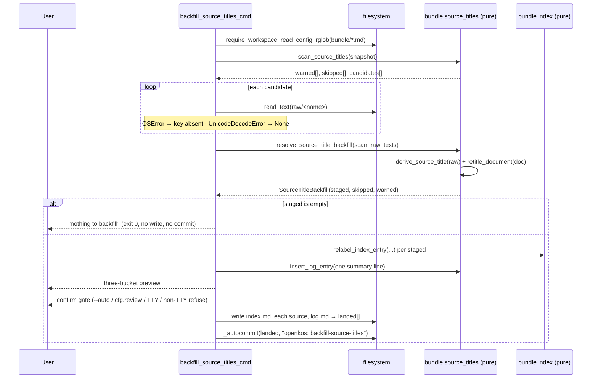

# Design: Backfill content-derived Source titles

**Change**: `source-title-backfill` · **Issue**: [#298](https://github.com/jasonssdev/openkos/issues/298) · **Baseline**: `main` @ `61b50ce`

## Technical Approach

`backfill-source-titles` is a structural sibling of `backfill-sensitivity` (`main.py:3590-3766`): impure Typer shell, pure core, Phase A read-only / Phase B write. It diverges in exactly three places — the core needs `raw/` text as well as the bundle snapshot, there are two write targets per Source instead of one, and the preview has three buckets.

The pure core is split in **two** so it stays a plain function of data (no injected callables, no `Path`): a cheap classification pass names which `raw/` files are worth reading, the CLI reads exactly those, then a second pass resolves them. This is what keeps every raw-read failure mode nameable and testable without a filesystem.

## Architecture Decisions

### D1 — The pure core lives in a new `src/openkos/bundle/source_titles.py`

| Option | Trade-off | Verdict |
|---|---|---|
| `bundle/provenance.py` (next to `resolve_backfill_raises`) | Right layer, wrong module: a title resolver is not provenance; that module owns closures and sensitivity ranking. | Rejected |
| `source_title.py` (next to `derive_source_title`) | That module's contract is explicit: it "MUST NOT know about filenames, slugs, or `_titleize`" and imports no `openkos` module. Adding a snapshot-walking, `okf`-importing sibling breaks it. | Rejected |
| New `bundle/source_titles.py` | `bundle/` is where pure `Mapping[str, str]` snapshot resolvers live (`provenance`, `links`, `relations`, `references`, `listing`). | **Chosen** |

Layering (AGENTS.md:40): `bundle` → `model` only. The module imports `openkos.model.okf`, `openkos.source_title`, `PurePosixPath`, stdlib — no derived layer (`retrieval`, `graph`, `memory`), no `pathlib.Path`, no I/O.

`_titleize` moves here as public `titleize(stem)`; `cli/main.py:1083` keeps `_titleize` as a one-line delegation. Decision 3's mechanical test is only sound if backfill and `ingest` share **one** implementation — a "narrower local twin" duplicate (the `_link_identity`/fence-marker precedent) is wrong here, because divergence silently misclassifies.

### D2 — Raw text is injected, never read by the core

Two pure entry points with one impure step between them:

1. `scan_source_titles(files)` — parses the snapshot, fills the `skipped`/`warned` buckets it can decide from frontmatter alone, and returns the surviving `candidates`, each naming its `resource`.
2. CLI reads `layout.raw_dir / name` for each candidate into `raw_texts: Mapping[str, str | None]`.
3. `resolve_source_title_backfill(scan, raw_texts)` — derives and stages.

`raw_texts` encodes failure in two ways, deliberately: a **missing key** means the file was absent or unreadable (`OSError`); an explicit **`None`** means it was present but undecodable (`UnicodeDecodeError`). Both land in `warned` with distinct reasons. The CLI catches `UnicodeDecodeError` *before* the outer `except (OSError, ValueError)`, exactly as `ingest` does (`main.py:1719-1725`) — `UnicodeDecodeError` subclasses `ValueError`, so ordering is load-bearing.

`derive_source_title` is **not called** when text is `None` or blank/whitespace-only. That contract is `ingest`'s (`main.py:1738-1742`), mirrored — not re-derived.

`resource` is malformed (warn + skip, `purge` precedent `main.py:2791-2821`) when it is absent, not a `str`, or not exactly `raw/<one-segment>`: a `..`, a nested path, a leading `/`, or a backslash all fail the check. Containment is proven before any path is built.

### D3 — One result value, `DescendantRaise` grain

```python
@dataclass(frozen=True)
class SourceRetitle:
    concept_id: str      # "sources/01-introduction"
    current_title: str
    new_title: str
    content: str         # full new document bytes, ready to write as-is

@dataclass(frozen=True)
class SkippedSource:   concept_id: str; current_title: str; reason: str
@dataclass(frozen=True)
class WarnedSource:    concept_id: str; reason: str

@dataclass(frozen=True)
class SourceTitleBackfill:
    staged:  tuple[SourceRetitle, ...]
    skipped: tuple[SkippedSource, ...]
    warned:  tuple[WarnedSource, ...]
```

Follows `okf.DescendantRaise` (`okf.py:421-439`) exactly: pre-rendered `content` so the CLI never re-renders, and **no `path` field** — `Path` is a filesystem concern; the caller derives `layout.bundle_dir / f"{concept_id}.md"`. Every tuple is sorted by `concept_id`, so preview order, write order and commit order are one deterministic order. The dataclasses live in `bundle/source_titles.py`, not `okf.py`: `okf.py` is the on-disk-shape seam, and this is a verb's DTO.

Closed reason vocabularies (drive preview text, pinned by test):

| Bucket | Reasons |
|---|---|
| `skipped` | `curated` · `no-derivable-title` · `empty-raw-source` · `already-current` |
| `warned` | `resource-missing` · `resource-malformed` · `raw-unreadable` · `raw-undecodable` · `heading-mismatch` |

### D4 — `retitle_document(text, *, current_title, new_title) -> str`

`load_frontmatter` → assert `metadata["title"] == current_title` → `metadata["title"] = new_title` → replace only `body.split("\n")[0]` → `dump_frontmatter`.

- **The safety assertion**: the first body line, after stripping at most one trailing `\r`, MUST equal `f"# {current_title}"`. Any other value — a hand-edited heading, a blank first line, an empty body — raises `ValueError` naming the concept and the line found. The resolver catches it and files that Source under `warned` / `heading-mismatch`; it never propagates as a traceback and never becomes a write.
- **CRLF**: a trailing `\r` is stripped for the comparison and re-attached verbatim to the replacement, so a CRLF document's first line stays CRLF and no other byte moves.
- **Round-trip honesty**: `okf.py:135-143` guarantees any byte sequence round-trips *value*-exact through `frontmatter.dumps`, and keys are re-emitted alphabetically (`okf.py:47-49`). For an engine-written Source this is byte-identical apart from the two intended edits. It is **not** byte-preserving for hand-edited frontmatter: YAML comments, key order and quoting style are normalized, and `frontmatter.loads` strips trailing body whitespace, so a document with two trailing newlines loses one. This is the exact exposure `resolve_backfill_raises` already accepts (`provenance.py:289`); accepted here on the same terms and documented in the docstring. A regex patch of the `title:` scalar was rejected — it means re-implementing YAML quoting for arbitrary titles, which is what `dump_frontmatter` is for.

### D5 — `relabel_index_entry(index_text, concept_id, new_title) -> tuple[str, int]`

New in `bundle/index.py`, shaped as `remove_index_entry`'s twin (`index.py:189-229`), not `insert_index_entry`'s:

- Frontmatter is split off byte-for-byte via `_split_frontmatter_verbatim` and **never re-dumped** (`index.py:20-31`, D2 discipline). No section splitting, no `# `-header parsing.
- The body is walked line by line. A candidate line is one whose `lstrip()` starts with `* ` or `- `; only its **first** markdown link is inspected, and identity is `_link_identity(target) == concept_id` (`index.py:150`) — never a label match, so a drifted label still converges and a bullet that merely mentions the concept later is never touched.
- Only the label span between `[` and `]` of that first link is rewritten. Indentation, bullet marker, link target bytes (`/sources/<slug>.md`), the ` - ` separator, the description and the line ending all round-trip verbatim. Slug and Concept ID are structurally untouchable here.
- `_reject_newline("title", new_title)` guard applies (`index.py:42-52`).
- **Zero matches** → `(index_text, 0)`, unchanged, not an error — catalog drift is not a reason to refuse an otherwise-safe write (`remove_index_entry`'s exact rule). **Multiple matches** → all are relabeled and the total is reported; leaving one stale label would be worse than the duplicate itself.
- Implementation note: use a new module-level `_LABELLED_LINK_RE = re.compile(r"\[([^\]]*)\]\(([^)]+)\)")` for this function only. Do **not** add a group to `_LINK_RE` — `remove_index_entry` reads `group(1)` as the target and must stay byte-identical.

### D6 — Write order is index-first, and that is deliberate

`backfill-sensitivity` writes items then the aggregate. Here the order is **`index.md` → each staged Source (sorted) → `log.md`**, because it is the only order whose partial state a re-run repairs. The classifier keys on the *document's* title: once a Source document is written, its title no longer equals `titleize(stem)`, so a re-run classifies it `curated` and would never revisit its bullet. Writing `index.md` first means a mid-sweep failure leaves the catalog ahead of the documents, and every unwritten document is still stageable; `relabel_index_entry` is idempotent by link identity, so the re-run rewrites the already-correct label to the same value.

Both the new `index.md` text and the new `log.md` text are computed in the pre-preview `try` block (as `backfill-sensitivity` computes `new_log_text`), so a malformed `index.md` refuses before any write.

No cross-file rollback, matching `set-sensitivity`/`relate`/`merge`/`backfill-sensitivity`: on failure the message names every path already on disk via the `landed` accumulator (appended only *after* each `write_atomic` returns) — `"... failed while writing the backfill -- {exc}. Already written (left partially retitled, not rolled back): {paths}."` No `_autocommit` runs, so the partial state stays uncommitted and `git checkout` restores it.

### D7 — ADR gate: **no ADR**

Condition (1) is arguably met — the change picks a pattern (surgical patch over regeneration, index-first ordering). Condition (2) is **not**: this writes no new schema, no new frontmatter key, no ledger version, and no persisted state; `raw/` is never touched; the whole operation is one `_autocommit` and `git revert` restores it exactly, with the inputs byte-identical afterwards. Contrast ADR-0012, which is warranted precisely because a *classification* decision is hard to reverse — over-classified data stays over-classified and under-classified data may already have leaked. A cosmetic label is not that. `config.yaml`'s tiebreak applies: when in doubt, do not create one. The one durable-sounding decision (log history is a record, never rewritten) produces no artifact and is recorded in the proposal and the spec.

## Data Flow

```
Phase A (read-only)                        Phase B (write, in this order)
──────────────────────────────────────     ─────────────────────────────
rglob(bundle) ─┐                           write_atomic(index.md)   ─┐
               ├─→ scan_source_titles      write_atomic(src #1..#n)  ├→ landed[]
               │      ├─ warned            write_atomic(log.md)     ─┘
               │      ├─ skipped                     │
               │      └─ candidates                  ↓
read raw/<n> ──┴─→ resolve_source_title_backfill  _autocommit(landed)
                          └─ retitle_document (assert `# {old}`)
```



The confirm gate is `backfill-sensitivity`'s precedence verbatim: `--auto` skips it; else `cfg.review == False` skips it; else a TTY prompts via `typer.confirm(abort=True)`; else (non-TTY, no `--auto`) it refuses to write and exits 1. Warned and skipped entries are shown but never gate: only an empty `staged` short-circuits.

## File Changes

| File | Action | Description |
|---|---|---|
| `src/openkos/bundle/source_titles.py` | Create | Pure core: `titleize`, `scan_source_titles`, `resolve_source_title_backfill`, `retitle_document`, 4 dataclasses |
| `src/openkos/bundle/index.py` | Modify | Add `relabel_index_entry` + `_LABELLED_LINK_RE` |
| `src/openkos/cli/main.py` | Modify | Add `backfill-source-titles`; `_titleize` delegates to `source_titles.titleize` |
| `tests/unit/bundle/test_source_titles.py` | Create | Pure-core cases |
| `tests/unit/bundle/test_index.py` | Modify | `relabel_index_entry` cases |
| `tests/unit/cli/test_backfill_source_titles.py` | Create | CLI cases |

## Reused Unchanged — do not reimplement

`source_title.derive_source_title` · `okf.load_frontmatter` / `dump_frontmatter` / `RESERVED_FILENAMES` · `index._split_frontmatter_verbatim` / `_link_identity` / `_LINK_RE` / `_reject_newline` / `_BULLET_MARKERS` · `log.insert_log_entry` · `fsio.write_atomic` · `config.require_workspace` / `read_config` / `WorkspaceLayout` (`bundle_dir`, `raw_dir`) · `cli.main._autocommit` · the `_slugify`/`_titleize` regexes · `tests/unit/cli/conftest.py`'s `snapshot_bytes` / `snapshot_with_mtime`.

## Testing Strategy

Strict TDD (RED→GREEN→REFACTOR), `uv run pytest`, branch coverage ≥ 90.

| Layer | What | Approach |
|---|---|---|
| Unit — `bundle/source_titles.py` | Every reason token; the `01-Introduction.md` counterexample (`_titleize(slug)` must not decide); `derive_source_title` not called for `None`/blank; `raw_texts` missing-key vs `None`; malformed `resource` shapes; determinism of ordering | `pytest.mark.parametrize` over in-memory `dict[str, str]` snapshots — no `tmp_path`, no filesystem |
| Unit — `retitle_document` | Byte-identical output apart from the two edits; heading mismatch / blank / absent first line raises; CRLF first line preserved; frontmatter key set unchanged | Golden-string assertions on `build_source_concept` output |
| Unit — `bundle/index.py` | Slug, link target, description, indentation, `-` marker, line ending preserved; 0 / 1 / N matches; newline rejection; malformed frontmatter `ValueError`; frontmatter block byte-identical | Golden-string assertions |
| CLI | Empty short-circuit (no write, no commit); three-bucket preview text; confirm-gate precedence ×4; one log entry; one commit; exit-1 message names `landed` paths; idempotent second run | `CliRunner` on `tmp_path` workspaces |
| CLI invariants | `raw/*` bytes, historical `log.md` entries, slugs, Concept IDs, `.openkos/*.db` unchanged | `snapshot_bytes` diff restricted to the expected paths; `snapshot_with_mtime` on decline/refusal to prove nothing was written at all |

## Threat Matrix

N/A — no routing, shell, subprocess, VCS/PR automation, executable-file classification, or process-integration boundary. `_autocommit` is the pre-existing commit seam, reused unchanged. The two adjacent risks are covered above by design, not by this matrix: path containment on `resource` (D2) and newline/label injection into `index.md` (D5, `_reject_newline`).

## Migration / Rollout

No migration. Operator-run verb; one commit; `git revert` restores frontmatter, body first lines and `index.md` together. `raw/` is never written, so the operation is fully re-runnable after a revert. No derived index is rebuilt (`reindex` stays the sole manual writer).

## Changed-line Estimate

Refines exploration's 650-900 upward — the repo's docstring density is the driver.

| Component | Src | Tests |
|---|---|---|
| `bundle/source_titles.py` | 180-230 | 200-260 |
| `bundle/index.py` primitive | 45-70 | 110-150 |
| CLI verb + `_titleize` delegation | 150-190 | 230-300 |
| **Total** | **375-490** | **540-710** |

**≈ 915-1200 changed lines.** Over the 800-line budget. Recommended slicing for `sdd-tasks` — three chained PRs, 1 and 2 independent, 3 depends on both: **(1)** `bundle/source_titles.py` + tests (~380-490); **(2)** `relabel_index_entry` + tests (~155-220); **(3)** CLI verb + tests (~380-490).

## Open Questions

- [ ] None blocking. `heading-mismatch` is filed under `warned` rather than a fourth bucket to honour the settled three-bucket preview; if review prefers it visually separated, that is a preview-rendering change only, not a core change.
